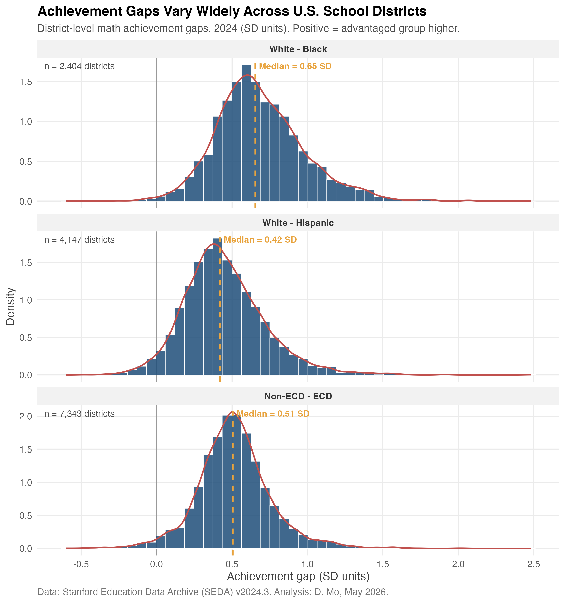
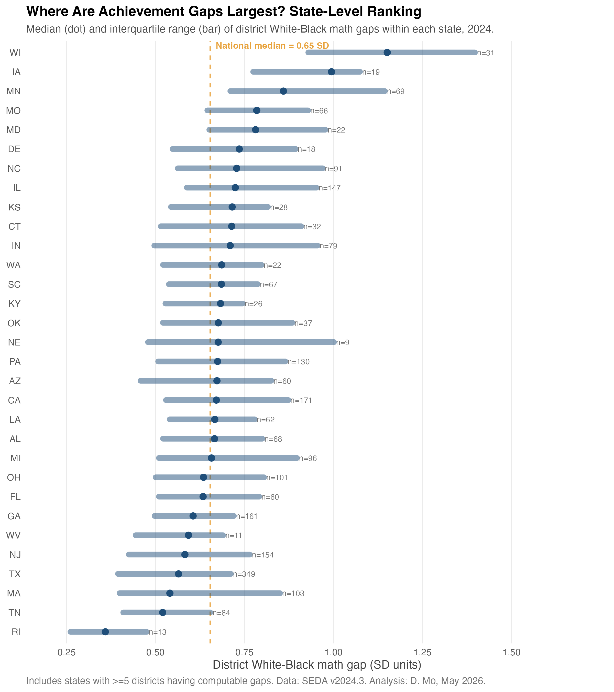
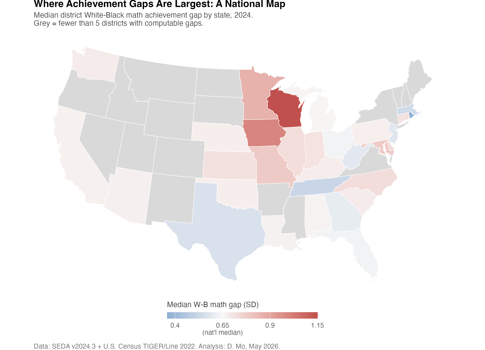
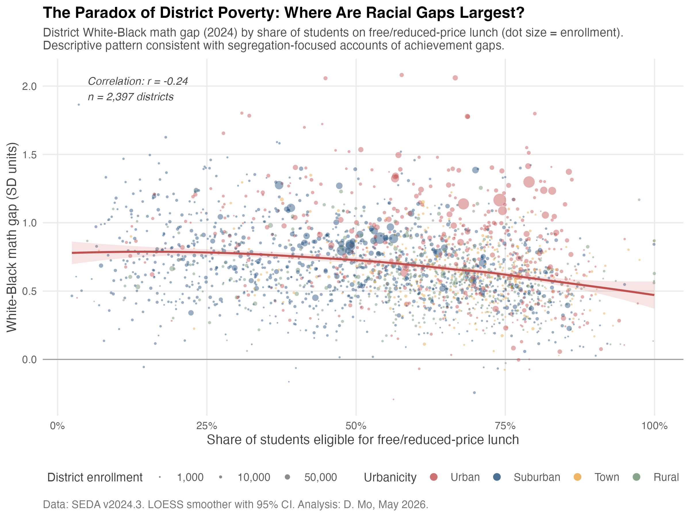
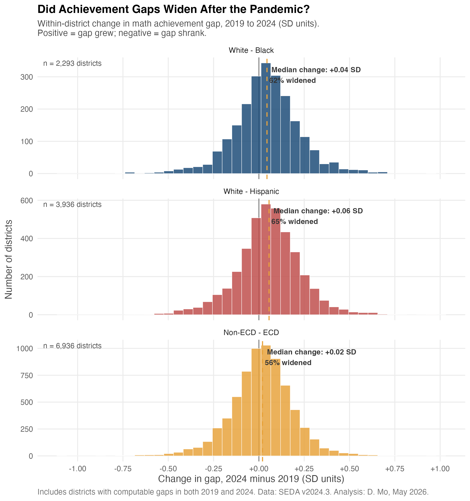

```{r setup, include=FALSE}
knitr::opts_chunk$set(
  echo = FALSE, warning = FALSE, message = FALSE,
  fig.align = "center", out.width = "90%",
  fig.pos = "H"
)
library(tidyverse)
library(knitr)
```

# Abstract {-}

This report applies descriptive data science methods to the Stanford Education Data Archive (SEDA, v2024.3) to characterize the geographic and demographic structure of academic achievement gaps in U.S. public school districts in 2024, the most recent year available. Across roughly 11,000 districts, the median White-Black math gap is 0.65 standard deviations (SD) — equivalent to roughly two grade levels of learning — and the median White-Hispanic and non-ECD vs. ECD gaps are 0.42 SD and 0.51 SD, respectively. Gaps are concentrated in the Upper Midwest, with Wisconsin (median 1.15 SD) showing the largest within-state district gaps in the country. Counter to a common assumption, district-level White-Black gaps are *negatively* associated with district poverty (r = -0.24): gaps are widest in low-poverty, demographically mixed districts, consistent with the segregation-based account of inequality (Reardon & Owens, 2014). Within-district comparison of 2019 and 2024 shows that 62-65% of districts saw racial gaps *widen* during the pandemic period, with White-Hispanic gaps growing fastest (median +0.06 SD). This analysis was conducted in R using SEDA's public covariate and achievement files, and code is available at the GitHub repository linked in the appendix.

# Introduction

Achievement gaps between racial, ethnic, and socioeconomic groups in U.S. schooling have been documented for over half a century, but their structural causes — and the contexts in which they are largest or smallest — remain a central question for education research and policy (Reardon, 2011; Reardon & Owens, 2014). The COVID-19 pandemic added urgency to this question by disrupting instruction unevenly across districts and student groups (Fahle et al., 2024). The release of SEDA v2024.3 in early 2026, which extends district-level achievement estimates through the 2023-24 school year, makes it possible for the first time to systematically characterize *post-pandemic* equity patterns at national scale.

This descriptive analysis pursues four questions, each chosen because the answer would be useful to school district leaders and to researchers studying district-level equity:

1. How wide are achievement gaps across the typical U.S. school district, and how much do they vary?
2. Where geographically are gaps largest?
3. What district-level conditions are associated with larger gaps?
4. Did the pandemic period widen or narrow within-district gaps?

The analysis is intentionally descriptive rather than causal. Its purpose is to map the terrain of district-level inequality, surface patterns that warrant further investigation, and establish a reproducible pipeline that other researchers can extend. The methods, data choices, and limitations are documented throughout.

# Data and Methods

## Data sources

This study uses two public files from SEDA v2024.3 (Reardon et al., 2026), distributed through the Educational Opportunity Project at Stanford University. The achievement file (`seda_admindist_annualsub_cs_2024.3.csv`) contains district-by-year-by-subject estimates of mean achievement for all students and for major demographic subgroups (race/ethnicity, gender, and economically disadvantaged status), constructed from EDFacts state assessment data and equated to the Cohort Scale (CS) using NAEP linking. The covariate file (`seda_cov_admindist_annual_2024.3.csv`) provides corresponding district-year characteristics, including racial/ethnic composition, share of students eligible for free/reduced-price lunch (FRL), an SES index, and urbanicity classification.

## Sample

The analytic snapshot is restricted to the 2023-24 academic year (denoted "2024" throughout), the most recent year in SEDA v2024.3. After merging the two files on district identifier, the working sample contains 11,273 administrative school districts with achievement estimates for all students. For analyses requiring subgroup contrasts, the effective sample is smaller because both subgroups must have non-suppressed estimates: 2,404 districts have a computable White-Black math gap, 4,147 have a White-Hispanic gap, and 7,343 have a non-ECD vs. ECD gap.

## Measures

Achievement is measured as the Empirical Bayes (EB) estimate of mean math performance on the Cohort Scale (variable cs_mn_avg_mth_eb). Two methodological choices warrant brief explanation. First, SEDA reports achievement on a Cohort Scale (CS) rather than as raw state test scores, because state assessments are not directly comparable across states or years. SEDA achieves comparability by linking each state's test data to NAEP, the federally administered test taken by a representative sample of students nationwide; the CS expresses each district's mean as standard deviations above or below the national grade-level mean for that cohort. One SD on this scale corresponds to roughly three years of typical learning growth between grades 4 and 8 (Fahle et al., 2024). This is the standard scale used in cross-district achievement research and is what allows a district in Wisconsin to be compared meaningfully with one in Texas.
Second, the EB estimator applies shrinkage toward the state mean for districts with small subgroup samples, reducing the noise that would otherwise dominate estimates for districts with few Black or Hispanic students. The alternative — ordinary least squares — produces unbiased but high-variance estimates for small districts; SEDA technical documentation recommends the EB estimates for any analysis comparing districts at scale.
Gaps are computed within district as the difference between the mean score of the historically advantaged group (White students; non-economically disadvantaged students, denoted "non-ECD") and the corresponding subgroup (Black, Hispanic, or economically disadvantaged students, denoted "ECD"). Positive gap values indicate that the advantaged group scored higher. Throughout this report, "achievement gap" refers to the math gap unless otherwise specified.

District characteristics include share of students eligible for FRL, total enrollment, racial/ethnic composition, the SES composite index, and urbanicity (Urban / Suburban / Town / Rural), all from the SEDA covariate file for 2024.

## Analytic approach

The analysis proceeds in four stages: (1) the national distribution of district-level gaps; (2) state-level aggregation to identify geographic concentration; (3) bivariate analysis of district characteristics that correlate with gap size; and (4) a within-district comparison of 2019 and 2024 to assess pandemic-period change. All analyses are descriptive. Figures use district-level data points without weighting; statewide summaries report unweighted medians and interquartile ranges. The within-district change analysis (Section 3.4) is restricted to the 10,135 districts with valid achievement estimates in both 2019 and 2024.

All data preparation, analysis, and visualization were carried out in R 4.6 using the tidyverse, sf, and tigris packages. All code, intermediate datasets, and output figures are available at the GitHub repository linked in the appendix.

# Findings

## The national distribution of achievement gaps

Figure 1 shows the distribution of district-level math achievement gaps across the 2024 sample. Three patterns are immediately visible. First, gaps are large on average: the median White-Black gap is 0.65 SD, the median White-Hispanic gap is 0.42 SD, and the median non-ECD vs. ECD gap is 0.51 SD. To translate, a 0.65 SD gap corresponds to roughly two grade levels of learning between groups in the same district. Second, the distributions are right-skewed and have substantial mass beyond 1 SD, indicating that a non-trivial number of districts exhibit gaps three or more grade levels wide. Third, almost no districts have gaps centered near zero or negative (i.e., subgroup outscoring the historically advantaged group): the gap is a near-universal feature of the U.S. district landscape rather than a property of a few outlier places.

```{r fig1, fig.cap="Distribution of district-level math achievement gaps in 2024. Each panel shows one gap type; orange dashed line marks the national median.", out.width="70%"}

```

\newpage

## Geographic concentration of inequality

Figure 2 ranks the 31 states with at least five districts having a computable White-Black math gap. The pattern is striking: the states with the largest district-level gaps are concentrated in the Upper Midwest. Wisconsin's median district gap of 1.15 SD is roughly double Rhode Island's (0.36 SD). Iowa, Minnesota, Missouri, and Maryland round out the top five. This pattern — gaps largest in states with relatively progressive policy reputations and relatively small Black populations — is well-documented and has been attributed to extreme residential and school segregation in metropolitan areas like Milwaukee and Minneapolis (Reardon et al., 2019).

```{r fig2, fig.cap="State-level ranking of district White-Black math gaps. Dot = within-state median; bar = interquartile range. Sample sizes shown to the right.", out.width="75%"}

```

The geographic pattern is reinforced by Figure 3, which maps the same statistics. The deep red corridor running from Wisconsin through Iowa is visible at a glance, while much of the South — often associated in public discourse with the largest racial gaps — falls closer to or below the national median.

```{r fig3, fig.cap="State-level choropleth of district White-Black math gaps in 2024. States with fewer than 5 computable districts shown in grey. Albers Equal Area projection.", out.width="80%"}

```

\newpage

## The paradox of district poverty

If gaps are not largest in the regions or districts with the highest poverty rates, where are they largest? Figure 4 plots the district White-Black math gap against the share of students eligible for free or reduced-price lunch — a standard measure of district poverty. The relationship is negative: r = -0.24, with the LOESS smoother sloping clearly downward from left to right. Gaps are widest in low-poverty, demographically mixed districts and narrowest in uniformly high-poverty districts.
This pattern is counter-intuitive at first reading. A common assumption in policy discussion is that the highest-poverty districts must also be the sites of the largest racial inequality. Figure 4 shows the opposite. There are at least two reasons for this, both well-established in the segregation literature.
First, the composition mechanism. In a district where 80% of all students qualify for free lunch, both the White and Black students in that district tend to be low-income. The advantaged-group score (the White students' mean) is itself depressed because those White students are themselves disadvantaged. The gap shrinks not because the disadvantaged group is doing better, but because the advantaged group is also doing poorly. The most-disadvantaged districts in Figure 4 — those at the right tail with FRL rates above 80% — are typically rural, small, or majority-minority urban districts where the small White population is not the relatively privileged subgroup that the term "White" suggests in national discourse.
Second, the segregation mechanism. Where racial gaps are largest is in districts that are demographically mixed but internally stratified — districts that contain both substantial White and substantial Black student populations, but where these students attend different schools, are tracked into different course sequences, or otherwise occupy different instructional environments. These tend to be middle-income suburban or metropolitan districts, which appear in the middle of the x-axis in Figure 4 and are disproportionately the sites of the highest gap values. Reardon and Owens (2014) showed in their landmark analysis that between-school segregation within a district is one of the strongest district-level predictors of the racial achievement gap, well above district-level poverty.
Taken together, these two mechanisms imply that the negative correlation in Figure 4 is not an artifact and is not in tension with what is known about racial inequality in U.S. schools. It is instead a useful corrective to a simplistic poverty-driven account: equity policy that targets the highest-poverty districts may not be targeting the districts with the largest racial gaps, because these are largely different sets of districts.

```{r fig4, fig.cap="District White-Black math gap (2024) by share of students on free/reduced-price lunch. Dot size = total enrollment, color = urbanicity. LOESS smoother with 95% CI.", out.width="78%"}

```

\newpage

## Did the pandemic widen achievement gaps?

The headline contribution of SEDA v2024.3 is the ability to compare achievement across the pandemic disruption. Figure 5 shows, for each district present in both 2019 and 2024, the change in its achievement gap. The overall pattern is one of modest but consistent widening. Sixty-two percent of districts (n = 2,293) saw their White-Black math gap grow between 2019 and 2024, with a median change of +0.04 SD. Sixty-five percent of districts saw their White-Hispanic gap grow (median +0.06 SD), and 56% saw their non-ECD vs. ECD gap grow (median +0.02 SD).
Two things about these numbers deserve unpacking. The first is that the shifts are small in absolute magnitude. A +0.04 SD widening is roughly six percent of the typical district's pre-pandemic White-Black gap of 0.65 SD; in instructional time, it is roughly five weeks of additional learning loss for the disadvantaged group relative to the advantaged group. Read in isolation, +0.04 SD might seem too small to be meaningful.
The second is that the direction matters more than the magnitude in a study of this scale. If pandemic disruption affected districts randomly with respect to equity — some districts' gaps narrowed, some widened, with the overall distribution centered on zero — we would expect roughly 50% of districts to show widening. The observation that 62-65% of districts moved in the same direction (widening) on the racial gaps is not consistent with random disruption. It indicates a systematic tilt in which the pandemic period set the typical U.S. district modestly back on equity, not forward. The shift is small per district but consistent in sign across thousands of districts, which is the pattern that should concern district leaders and state policymakers.
The fact that the White-Hispanic gap widened the most (median +0.06 SD; 65% of districts widened) is consistent with reporting that English Learner students and Hispanic students experienced disproportionate disruption during remote instruction, and that recovery resources during 2022-24 reached them less consistently than they reached White and African American students (Fahle et al., 2024). The non-ECD vs. ECD gap, by contrast, widened in only 56% of districts and the median change was just +0.02 SD — barely distinguishable from zero. One reading of this contrast is that pandemic-era support targeted at low-income students (Title I supplements, ESSER funds) reached the income axis more effectively than it reached the racial/ethnic axis, but disentangling the two would require analysis the present descriptive design cannot support.

```{r fig5, fig.cap="Within-district change in math achievement gaps, 2019 to 2024. Each district contributes one observation per panel. Sample restricted to districts with computable gaps in both years.", out.width="70%"}

```

\newpage

# Discussion and Limitations

This descriptive analysis surfaces four findings worth carrying forward. First, district-level achievement gaps in the U.S. are large and near-universal: the median district has a White-Black math gap of two grade levels, and only a small minority of districts approach parity. Second, gaps are geographically concentrated, with the Upper Midwest hosting the largest within-state gaps in the country — a pattern that warrants closer engagement from researchers and district leaders in those states. Third, the negative correlation between district poverty and racial gap size is a useful corrective to the assumption that targeting high-poverty districts is the same as targeting the largest equity gaps; the two are partially decoupled. Fourth, the pandemic period appears to have widened racial gaps in a majority of districts, with White-Hispanic gaps growing most.

Several limitations should temper interpretation. The analysis is descriptive: associations reported here are not causal estimates, and the bivariate relationship between district poverty and racial gaps in particular has well-known confounders, including district size, regional history, and segregation indices not used here. The 2024 sample over-represents districts with state-reported assessment data in the post-pandemic period and likely under-represents districts where suppression rules eliminated subgroup estimates. The state-level map aggregates within-district gaps to a state median, which obscures within-state heterogeneity that the dot-and-whisker figure (Figure 2) makes visible; future work could use SEDA's geographic district crosswalk to produce county-level maps. Finally, math achievement was used throughout for compactness; reading/language arts gaps follow similar but not identical patterns and merit parallel analysis. All code is structured to make these extensions straightforward.

# References {-}

Fahle, E. M., Kane, T. J., Reardon, S. F., & Staiger, D. O. (2024). *The first year of pandemic recovery: A district-level analysis*. Education Recovery Scorecard.

Reardon, S. F. (2011). The widening academic achievement gap between the rich and the poor: New evidence and possible explanations. In G. J. Duncan & R. J. Murnane (Eds.), *Whither opportunity?* Russell Sage Foundation.

Reardon, S. F., & Owens, A. (2014). 60 years after *Brown*: Trends and consequences of school segregation. *Annual Review of Sociology*, 40, 199-218.

Reardon, S. F., Weathers, E. S., Fahle, E. M., Jang, H., & Kalogrides, D. (2019). *Is separate still unequal? New evidence on school segregation and racial academic achievement gaps* (CEPA Working Paper No. 19-06). Stanford Center for Education Policy Analysis.

Reardon, S. F., Fahle, E. M., Ho, A. D., Shear, B. R., Saliba, J., Min, J., Shim, J., & Kalogrides, D. (2026). *Stanford Education Data Archive (Version SEDA 2024.3)*. https://purl.stanford.edu/wh992dd5709

# Appendix: Reproducibility {-}

All analysis code, including data cleaning scripts (`01_setup_and_load.R`, `02_clean_and_merge.R`) and individual figure scripts (`03_figure1_gap_distributions.R` through `07_figure5_pre_post_pandemic.R`), is available at:

`https://github.com/daochengmo/seda-equity-analysis`

```{r session, echo=FALSE, results='asis'}
cat("**Software environment.** R", paste(R.version$major, R.version$minor, sep = "."),
    "with tidyverse, sf, tigris, and patchwork. Analysis run on macOS (Apple Silicon), May 2026.\n")
```